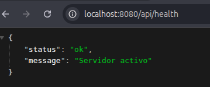

# Plataforma de Eventos e Inscripciones

Pre-entrega 1 del curso **Programación Backend II: Diseño y Arquitectura Backend** (Coderhouse).

Base arquitectónica de una API REST con Express, organizada por capas y lista para escalar en las próximas entregas (auth, JWT, roles, eventos, inscripciones, cupos y notificaciones).

## Temática

Plataforma de eventos e inscripciones: los usuarios se registran, ven eventos disponibles y se inscriben. En esta etapa solo se deja armada la base arquitectónica.

## Tecnologías

- Node.js (ESM)
- Express
- Mongoose
- dotenv

## Instalación

```bash
npm install
```

## Variables de entorno

Crear un archivo `.env` en la raíz a partir de `.env.example`:

```bash
cp .env.example .env
```

| Variable    | Descripción                        |
|-------------|------------------------------------|
| PORT        | Puerto del servidor                |
| NODE_ENV    | Entorno (development / production) |
| MONGO_URL   | URL de conexión a MongoDB          |
| JWT_SECRET  | Secreto para firmar los JWT        |

## Cómo ejecutar

```bash
npm start
```

Modo desarrollo (recarga al guardar):

```bash
npm run dev
```

El servidor queda en `http://localhost:PORT`.

## Estructura de carpetas

```
src/
├── app.js                # configura Express (NO levanta el server)
├── server.js             # levanta el servidor
├── config/
│   └── config.js         # variables de entorno centralizadas
├── routes/
│   ├── health.router.js
│   ├── events.router.js
│   └── sessions.router.js
├── controllers/
│   ├── health.controller.js
│   ├── events.controller.js
│   └── sessions.controller.js
├── services/
│   └── events.service.js
├── repositories/
│   └── events.repository.js
├── dao/
│   └── events.dao.js
├── models/
│   ├── User.js           # campos mínimos
│   └── Event.js          # campos mínimos
├── middlewares/
└── utils/
```

## Rutas disponibles

| Método | Ruta           | Descripción                          | Respuesta                                          |
|--------|----------------|--------------------------------------|----------------------------------------------------|
| GET    | /api/health    | Estado del servidor                  | `{ "status": "ok", "message": "Servidor activo" }` |
| GET    | /api/events    | Lista de eventos (vacía por ahora)   | `{ "status": "success", "payload": [] }`           |
| GET    | /api/sessions  | Base de sessions (sin auth todavía)  | `{ "status": "success", "message": "..." }`        |

## Evidencia

`GET /api/health` respondiendo OK:


